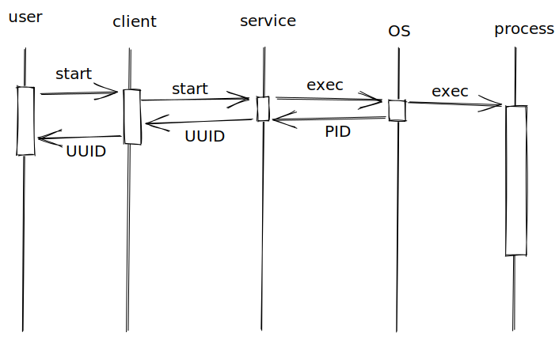
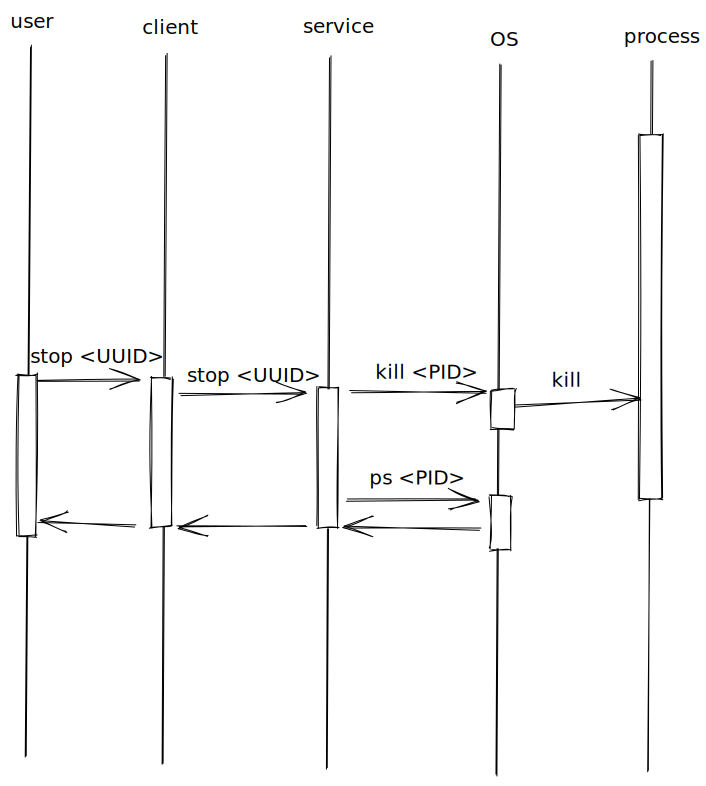
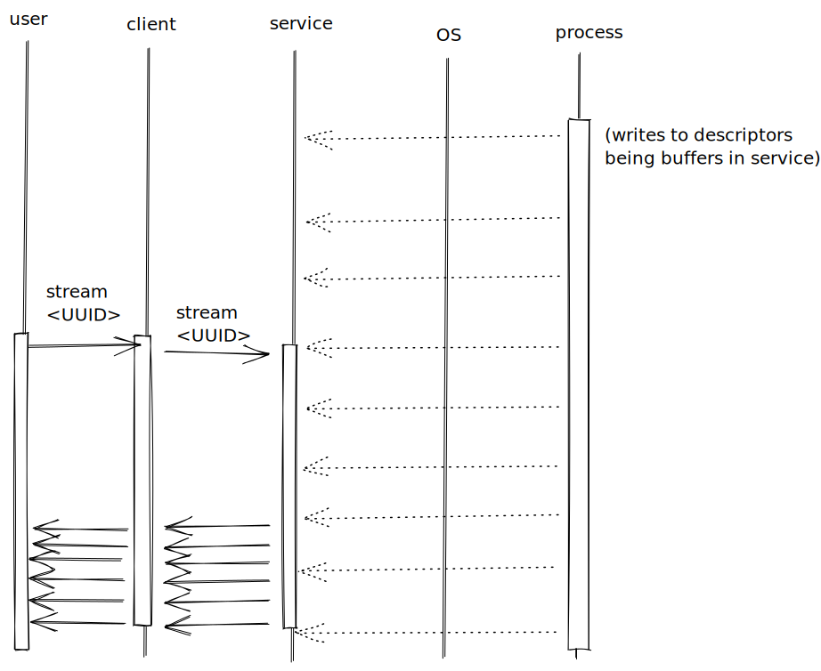
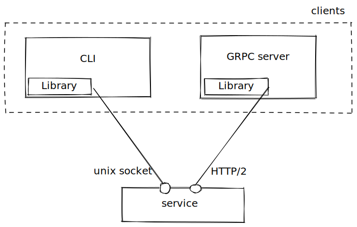

Design doc
========================

# Functional requirements
`process_manager` is a tool that manages processes.\
In order to provide full functionality, managed processes must be started using this tool.\
Clients (_Library_, _GRPC_, _CLI_) use UUID instead of PID to avoid collisions.

It provides abilities to:
* start a process
* stop a process
* query status of a process
* handle process output
    * get output atomically
    * stream output

It's expected to work on 64-bit Linux.
## Basic sequence diagrams
 

## Service 
Thats's a `process_manager` engine. Functionalities are implemented here.\
It talks to the OS and maps PIDs to UUIDs.\
It acts as a server to clients implemented using _Library_.

## Library
Library = `process_manger` client API in Go.

## GRPC API
_Library_ exposed using GRPC.
### Protobuf
- TODO
### Security
- TODO mtls
- TOOD cipher suites
- TODO simple auth scheme
## CLI
_Library_ exposed to command line users.\
All process' output is printed to `stdout`, including log stream.\
User can stop stream using `SIGINT` (ctrl+c) signal.
### Security
Authentication is not needed - user is already authenticated to OS it's logged in.

# Use cases
| case | expected result |
| --- | --- |
| User requests process to be started | process is started; process UUID is returned |
| User requests process to be started; but it won't start | process isn't started; OS response is returned |
| User requests process to be stopped | process is stopped; exit code is returned |
| User requests process to be stopped; but it won't stop | process is not stopped; process status is returned |
| User requests process status | process is stopped; exit code is returned |
| User requests process output | output is returned |

# Technical design

## Service

## Library
## GRPC API
## CLI
# Milestones
