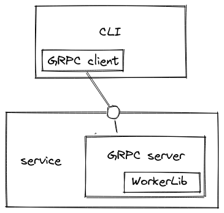

Design doc
========================

# Functional requirements
`process_manager` is a tool that manages processes on Linux.\
In order to provide full functionality, managed processes must be started using this tool.\
Clients (_GRPC_, _CLI_) use `JobUUID` instead of `PID` to avoid collisions.

It provides abilities to:
* start a process
* stop a process
    1. _Worker_ sends `SIGTERM` signal to the process
    2. _Worker_ waits for process to exit for hardcoded 3s
    3. _Worker_ returns process `exit code`
* query status of a process
    * subset of `/proc/PID/status` - seems enough for demo purposes, see [protobuf](../proto/process_manager.proto)
* handle process output
    * stream buffered output from _start_ until _now_ and then following until process exit or user's interruption 

Processes are run as OS user who's running the _Worker_.\
Processes output is stored in memory which imposes output size restrictions.\
Processes output is handled as bytes. Caller should convert it to expected encoding.

## Basic sequence diagrams
 


## Use cases (CLI)
| case | CLI args | result |
| --- | --- | --- |
| do XXX request on remote machine | `--cacertpath=<ca.crt> --clientkeypath=<client.key> --clientcertpath=<client.crt> --address=<remote_host_addr:port> XXX` | response printed to `stdout` |
| do XXX request on remote machine with invalid client certificate | `--cacertpath=<ca.crt> --clientkeypath=<client.key> --clientcertpath=<client.crt> --address=<remote_host_addr:port> XXX` | grpc error `UNAUTHENTICATED` |
| start `ping 1.1.1.1` process | (line above +) `--name=ping --args="1.1.1.1"` | `JobUUID` printed to `stdout` |
| stop Job number 1234 | `stop --jobuuid=1234` | result returned (exit code or grpc error code) |
| output of Job number 1234 | `output --jobuuid=1234` | Job's output printed from the beginning until now and then following, `tail -f -n +1` equivalent |
| break output stream of Job number 1234 | `ctrl-c` | client ends connection with server and exits gracefully |
| status of Job number 1234 | `status --jobuuid=1234` | status printed |
| stop not-owned job | `stop --jobuuid=111` | grpc error `PERMISSION_DENIED` returned |

# Technical design
## Components diagram



### Library
The `process_manager`'s internals implementation. \
It talks to the OS to manage processes.\
API input is `PID` (not `JobUUID`).

### Worker
Background process with GRPC server running.

State:
- `JobUUID`:`PID` mapping
- output (`stdout`+`stderr` combined) cache

#### Configuration
- `$ADMIN_CERTS_PATHS`environment variable - paths (splited with `;`) to clients certificates who have elevated rights
#### Architecture
- GRPC Server listens on hardcoded port (8080)
- managed process instance is represented as `JobUUID` in a map held by worker
- `start` request, if succeeded, creates `JobUUID`
  - writes to map are synchronized
- other requests use `JobUUID` as key, no data races should occur if multiple requests are handled in parallel
- `stop` request acquires `JobUUID_mutex`
  - waits until process is stopped or until hardcoded timeout
  - `JobUUID` is marked as stopped, but user can still get an output or status
    - limitation: all data is held in memory

### GRPC Server
_Library_ exposed using GRPC.\
`start` request is passed to _Library_, which returns `PID`; `PID` is mapped on `JobUUID`; `JobUUID` is returned as response.\
Each other request is passed to _Library_ with `JobUUID` translated to `PID`. 
#### Protobuf
[../proto/process_manager.proto](../proto/process_manager.proto)
### Authentication
mTLS Authentication
- cipher suites:
    - src: https://github.com/ssllabs/research/wiki/SSL-and-TLS-Deployment-Best-Practices
    - TLS1.3 or TLS1.2 are the only valid choices
    - cipher suite ordered by: security, compatibility, performance
    ```
    TLS_ECDHE_ECDSA_WITH_AES_128_GCM_SHA256
    TLS_ECDHE_ECDSA_WITH_AES_256_GCM_SHA384
    TLS_ECDHE_ECDSA_WITH_AES_128_CBC_SHA
    TLS_ECDHE_ECDSA_WITH_AES_256_CBC_SHA
    TLS_ECDHE_ECDSA_WITH_AES_128_CBC_SHA256
    TLS_ECDHE_ECDSA_WITH_AES_256_CBC_SHA384
    TLS_ECDHE_RSA_WITH_AES_128_GCM_SHA256
    TLS_ECDHE_RSA_WITH_AES_256_GCM_SHA384
    TLS_ECDHE_RSA_WITH_AES_128_CBC_SHA
    TLS_ECDHE_RSA_WITH_AES_256_CBC_SHA
    TLS_ECDHE_RSA_WITH_AES_128_CBC_SHA256
    TLS_ECDHE_RSA_WITH_AES_256_CBC_SHA384
    TLS_DHE_RSA_WITH_AES_128_GCM_SHA256
    TLS_DHE_RSA_WITH_AES_256_GCM_SHA384
    TLS_DHE_RSA_WITH_AES_128_CBC_SHA
    TLS_DHE_RSA_WITH_AES_256_CBC_SHA
    TLS_DHE_RSA_WITH_AES_128_CBC_SHA256
    TLS_DHE_RSA_WITH_AES_256_CBC_SHA256
    ```
### Authorization
User is an owner of `JobUUID`.\
User's resources are isolated so that _userA_ cannot see or alter _userB_ processes.

User can have acceess all proceses (`admin` mode) - see _Worker_ configuration
### CLI
_Library_ exposed to command line users.\
GRPC Client under the hood.

All CLI's output is printed to `stdout`, including requested process's log stream.\
User can stop stream using `SIGINT` (ctrl+c) signal.

CLI is generated with `"github.com/spf13/cobra"`\
Commands cover all functionalities exposed by _GRPC Server_.

### Configuration
Commandline options:
- `cacertpath` - CA cert path
- `clientkeypath` - client key path
- `clientcertpath` - client cert path
- `address` - GRPC Server address, `localhost:8080` by default
