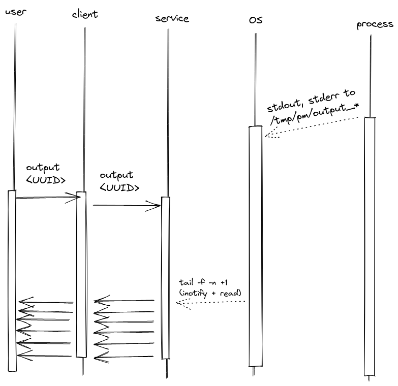

Design doc
========================

# Functional requirements
`process_manager` is a tool that manages processes on Linux.\
In order to provide full functionality, managed processes must be started using this tool.\
Clients (_GRPC_, _CLI_) use `UUID` instead of `PID` to avoid collisions.

It provides abilities to:
* start a process
* stop a process
    1. _Worker_ sends `SIGTERM` signal to the process
    2. _Worker_ waits for process to exit for hardcoded 3s, else process is killed with `SIGKILL`
* query status of a process (see [protobuf](../proto/process_manager.proto))
    * state (running, stopped)
    * started date
    * stopped date
    * exit code
    * [status from system](https://golang.org/pkg/syscall/#WaitStatus)
* handle process output
    * stream buffered output from _start_ until _now_ and then following until process exit or user's interruption 

Processes are run as OS user who's running the _Service_.\
Processes output is stored in `/tmp/process_manager/output_*` (`chmod 0600`).\
Processes output is handled as bytes. Caller should convert it to expected encoding.\
`process_manager` doesn't control process resources. \
Processes can fork.\
Path traversal is allowed.

## Basic sequence diagrams
 




## Use cases (CLI)
| case | CLI args | result |
| --- | --- | --- |
| do XXX request on remote machine | `--cacertpath=<ca.crt> --clientkeypath=<client.key> --clientcertpath=<client.crt> --address=<remote_host_addr:port> XXX` | response printed to `stdout` |
| do XXX request on remote machine with invalid client certificate | `--cacertpath=<ca.crt> --clientkeypath=<client.key> --clientcertpath=<client.crt> --address=<remote_host_addr:port> XXX` | grpc error `UNAUTHENTICATED` |
| start `ping 1.1.1.1 -i4` process | (line above +) `start ping 1.1.1.1 i4` | `UUID` printed to `stdout` |
| start `../traversal/aaa` process | `start ../traversal/aaa` | `UUID` printed to `stdout` |
| stop Job number 1234 | `stop --UUID=1234` | result returned (exit code or grpc error code) |
| output of Job number 1234 | `output --UUID=1234` | Job's output printed from the beginning until now and then following, `tail -f -n +1` equivalent |
| break output stream of Job number 1234 | `ctrl-c` | client ends connection with server and exits gracefully |
| status of Job number 1234 | `status --UUID=1234` | status printed |
| stop not-owned job | `stop --UUID=111` | grpc error `PERMISSION_DENIED` returned |

# Technical design
## Components diagram


### WorkerLib
The `process_manager`'s internals implementation. \
It talks to the OS to manage processes.

API works on `Job` objects.

```golang
const (
	Running JobState = iota
	Stopped          = iota
)

type job struct {
	*exec.Cmd
	state JobState

	startedDate time.Time
	exitedDate  time.Time

	outputFile *os.File
	
	owner CommonName
	
	sync.RWMutex
}
```

### Service
Background process with GRPC server running.

State:
- `UUID`:`job` mapping

#### Configuration
- `$ADMIN_CN`environment variable - `CommonName`s of clients who have elevated rights (splited with `;`)
#### Architecture
- GRPC Server listens on hardcoded port (8080)
- managed process instance is mapped on `UUID` in a map held by service
  ```golang
  map[UUID]job
  ```
- `start` request, if succeeded, creates a `job` and `UUID` which it's assigned to
  - writes to map are synchronized
  - reads from map can happen concurrently
  - map cannot be read during write
- `output`, `status`, `stop` requests use `UUID` as key, no data races should occur if multiple requests are handled concurrently
- `status` acquires `job.RLock` not to report partially changed process during `stop` (small chance, but still).
- `output` data is read from file in filesystem. It's safe and convenient because OS provides synchronization. 
- `stop` 
  - request is thread-safe even if multiple stop requests for single `UUID` are handled
  - process would receive more than one `SIGTERM` signals - and it's POSIX compliant
  - `job` is stopped, but user can still get an output or status using `UUID`
  - acquires `job.Lock` to block `status` from reading

### GRPC Server
_WorkerLib_ exposed using GRPC.
#### Protobuf
[../proto/process_manager.proto](../proto/process_manager.proto)
### Authentication
mTLS Authentication
- cipher suites:
    - src: https://github.com/ssllabs/research/wiki/SSL-and-TLS-Deployment-Best-Practices
    - `"crypto/tls"` package is safe to use, no need to use alternatives like `OpenSSL`
    - TLS1.3, default configuration is safe and efficient:
  ```golang
  tls.Config{
      MinVersion:   tls.VersionTLS13,
  },
  ```
### Authorization
Users are distinguished by `CommonName` field in public certificate.\ 
PKI guarantees no two distinct users get the same `CN`.

User is an owner of `UUID`.\
User's resources are isolated so that _userA_ cannot see or alter _userB_ processes.

User can be granted acceess to all proceseses (`admin` mode) - see _Service_ configuration
### CLI
_WorkerLib_ exposed to command line users.\
GRPC Client under the hood.

All CLI's output is printed to `stdout`, including requested process's log stream.\
User can stop stream using `SIGINT` (ctrl+c) signal.

CLI is generated with `"github.com/spf13/cobra"`\
Commands cover all functionalities exposed by _GRPC Server_.

### Configuration
Commandline options:
- `cacertpath` - CA cert path
- `clientkeypath` - client key path
- `clientcertpath` - client cert path
- `address` - GRPC Server address, `localhost:8080` by default
