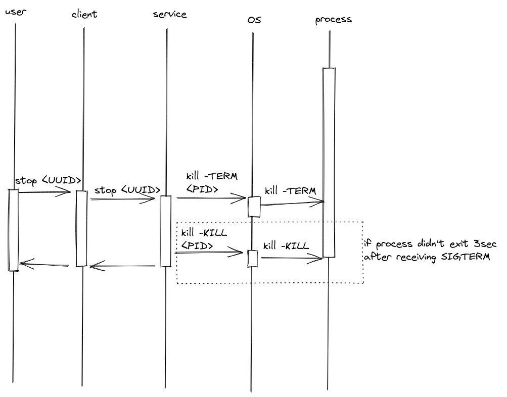

Design doc
========================

# Functional requirements
`process_manager` is a tool that manages processes on Linux.\
In order to provide full functionality, managed processes must be started using this tool.\
Clients (_Library_, _GRPC_, _CLI_) use UUID instead of PID to avoid collisions.

It provides abilities to:
* start a process
    * TBD: to what extent should it be flexible?
        * executable name
        * executable path
        * environment variables
        * arguments
* stop a process
    * TBD: hardcoded timout?
* query status of a process
    * TBD: what exactly do we mean by "status"?
    * `/proc/PID/status` - seems enough for demo purposes, [linux manual page](https://man7.org/linux/man-pages/man5/proc.5.html)
* handle process output
    * get output from start until _now_
    * stream output from _now_

Processes are run as user who's running the _Worker_.\
Processes output is stored in memory which imposes output size restrictions.\
Processes output is handled as bytes. Caller should convert it to expected encoding.

## Basic sequence diagrams
 




## Components


### Worker 
Thats's the `process_manager`'s engine. Functionalities' logic is implemented here.\
It talks to the OS and maps PIDs to UUIDs.\
It acts as a server to clients implemented using _Library_.

### Library
`process_manger`'s client API in Go.

### GRPC API
_Library_ exposed using GRPC.
#### Protobuf
- TODO
#### Security
- mtls
    - cipher suites:
        - TLS1.3
            - just default stuff:
            ````
            TLS_AES_256_GCM_SHA384
            TLS_CHACHA20_POLY1305_SHA256
            TLS_AES_128_GCM_SHA256
            ````
        - TLS1.2
            - ECDHE only:
            ```
            ECDHE-ECDSA-AES256-GCM-SHA384
            ECDHE-RSA-AES256-GCM-SHA384
            ECDHE-ECDSA-CHACHA20-POLY1305
            ECDHE-RSA-CHACHA20-POLY1305
            ECDHE-ECDSA-AES256-SHA384
            ```
- simple auth scheme
    - basic auth with hardcoded user/password for demo purposes
    - no RBAC 
### CLI
_Library_ exposed to command line users.\
All CLI's output is printed to `stdout`, including requested process's log stream.\
User can stop stream using `SIGINT` (ctrl+c) signal.
#### Security
Authentication is not needed - user is already authenticated to OS it's logged in.

# Use cases
| case | expected result |
| --- | --- |
| User requests process to be started | process is started; process UUID is returned |
| User requests process to be started; but it won't start | process isn't started; OS response is returned |
| User requests process to be started; but it won't start | process isn't started; OS response is returned |
| User requests process to be stopped | process is stopped; exit code is returned |
| User requests process to be stopped; but it won't stop | process is not stopped; process status is returned |
| User requests process status | process is stopped; exit code is returned |
| User requests process output | output is returned |
| User provides wrong credentials | HTTP 403 |

# Technical design
## Worker
Process running on host in background.
### Communication
- unix socket for CLI
### Architecture
- listen for connections on a socket, handle them asynchronously
- process instance is represented as UUID in a map held by worker
- `start` request creates `UUID`
- other requests use `UUID`, they require `UUID_mutex` to be unlocked
- `stop` request should acquire `UUID_mutex`
    - waits until process is stopped or until hardcoded timeout
    - removes `UUID` from map

## Library
Provides connection to _Worker_ using unix socket.\
Proxy to _Worker_'s functionalities that should be client facing.
## GRPC Server
Exposes GRPC API on hardcoded port (8080).
Uses _Library_ to connect to the _Worker_.
## CLI
CLI is generated with `"github.com/spf13/cobra"`\
Commands cover all _Library_ functions.\
_Library_ is used to connect to the _Worker_.
